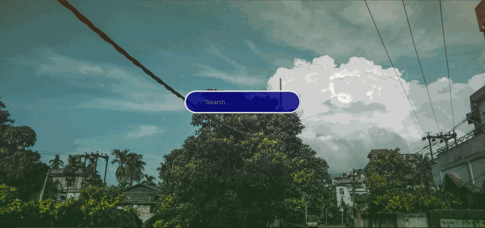

## Progressive Weather Web-App  

Simple React.js Web App using <a href="https://openweathermap.org/" target="_blank" style="text-decoration:none;">openweathermap<a> API.

Fork/download the code and follow along =>

- #### `npm install` 

- #### `npm start`

> Inspired by <a href="https://github.com/adrianhajdin/project_weather_pwa" target="_blank">Adrian Hajdin</a>.
